# Cara deploy web Laravel dengan Github Webhook.
Bagi teman-teman yang memiliki VPS, mempunyai repository Github yang berisikan web Laravel serta kebingungan cara menyebarkan aplikasi Anda (deploy) maka Anda berada di tempat yang tepat. Di tulisan ini saya akan berbagi cara konfigurasinya.

## Persiapan
1. Mempunyai VPS dan saya menggunakan Ubuntu
1. Membuat SSH key di VPS dan menaruh public key di repository yang Anda punya.
1. Melakukan konfigurasi `sudo` tanpa password untuk reload php-fpm dan chgrp
1. Memasang port custom di firewall.

### Membuat SSH key di VPS dan menaruhnya di repository yang Anda punya.
Jika Anda belum membuat SSH key di VPS dengan user yang Anda butuhkan (misalnya: ```deployer```),
silahkan ikuti [panduan dari Github tentang cara membuat SSH key](https://help.github.com/articles/generating-a-new-ssh-key-and-adding-it-to-the-ssh-agent/).
Bagi Anda yang sudah membuat lanjut ke langkah di bawah ini untuk mencetak public key:

```bash
cd ~/.ssh
cat id_rsa.pub
```

Selanjutnya, copy paste hasil keluaran tersebut dan taruh di repository Github Anda => Settings => Deploy keys. Saya akan ambil repository ```laravel-basic``` sebagai contoh.

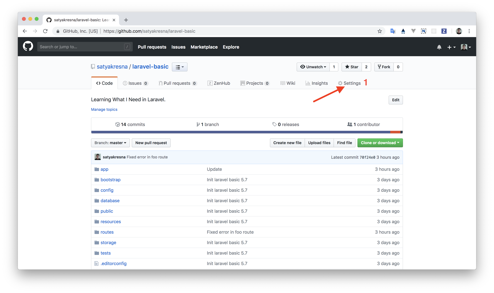

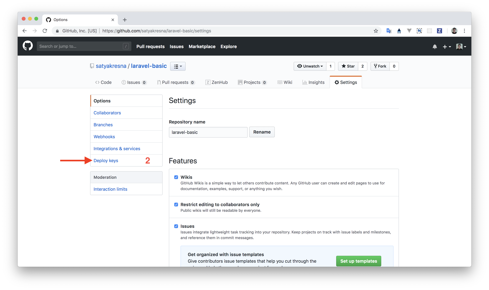

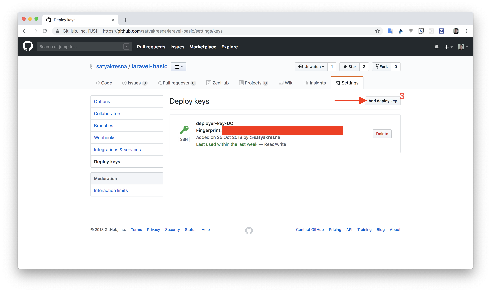

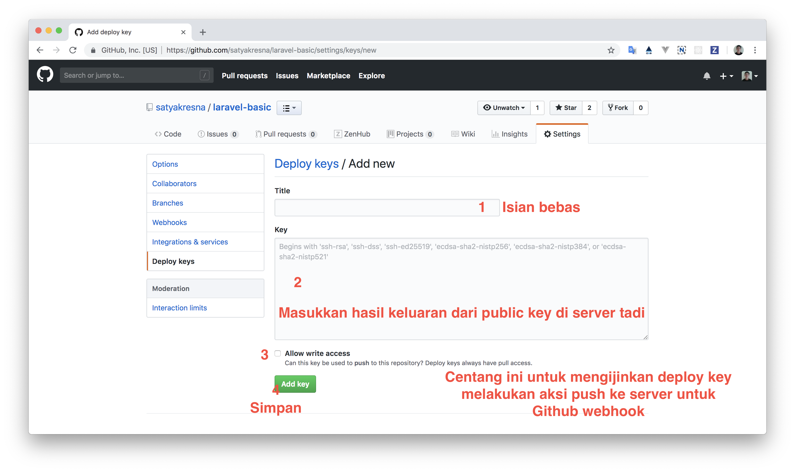

### Melakukan konfigurasi `sudo` tanpa password untuk reload php-fpm dan chgrp
Silahkan login dengan user yang memiliki akses sudo atau user root dan ketik perintah ```sudo visudo``` dan sisipkan baris ini di paling bawah.

```bash
# For reload php 7.2
%deployer ALL = NOPASSWD: /usr/sbin/service php7.2-fpm reload
%www-data ALL=(ALL:ALL) NOPASSWD: /usr/sbin/service php7.2-fpm reload

# Allow user to run commands without passwd ex. chgrp
%deployer ALL = NOPASSWD: /bin/chgrp
```

### Memasang port custom di firewall.
Karena kita akan menggunakan package Github Webhook dan NodeJS, pastikan Anda memasang port custom di firewall agar firewall membuka akses custom port. Sejauh ini ada dua cara, yakni di tempat kita membeli VPS (saya membeli di Digital Ocean) atau langsung di terminal
server kita.

1. Di droplet Digital Ocean
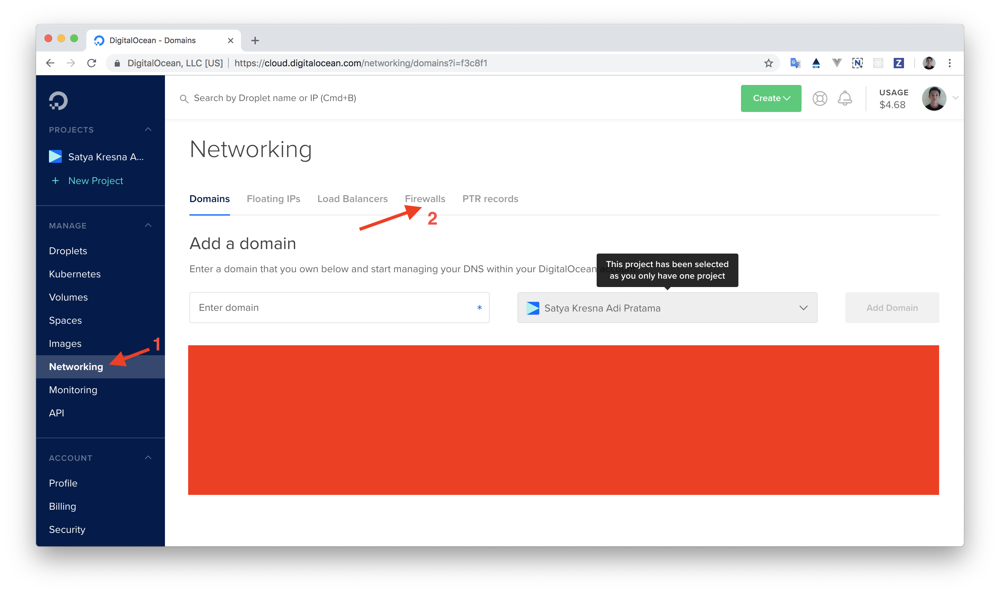

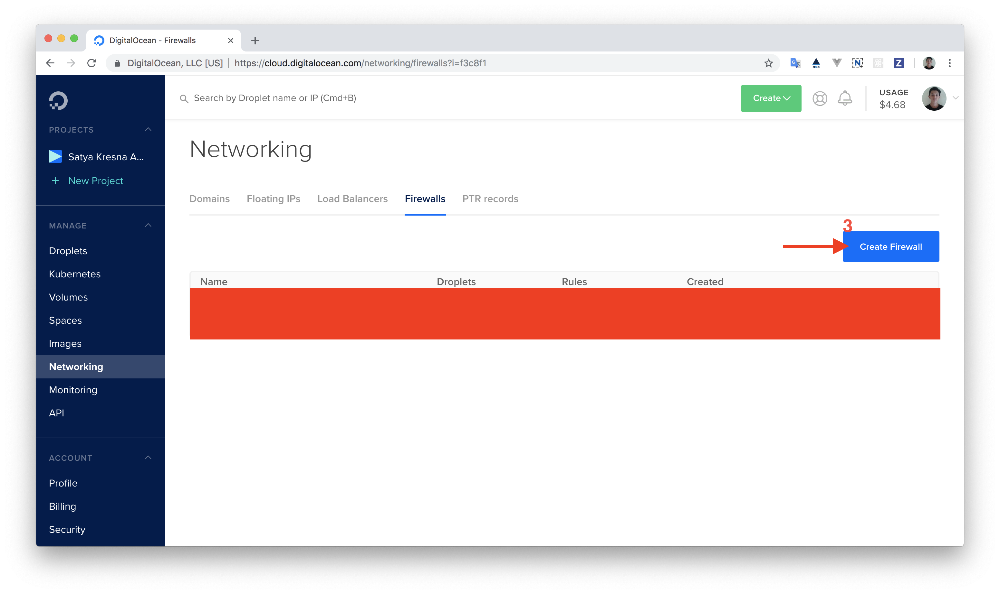

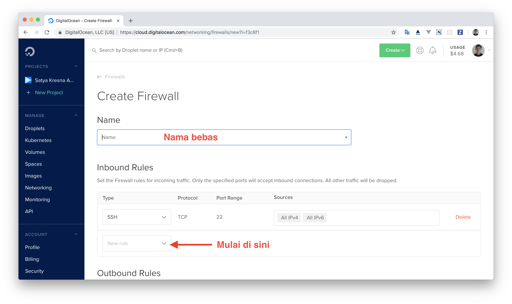

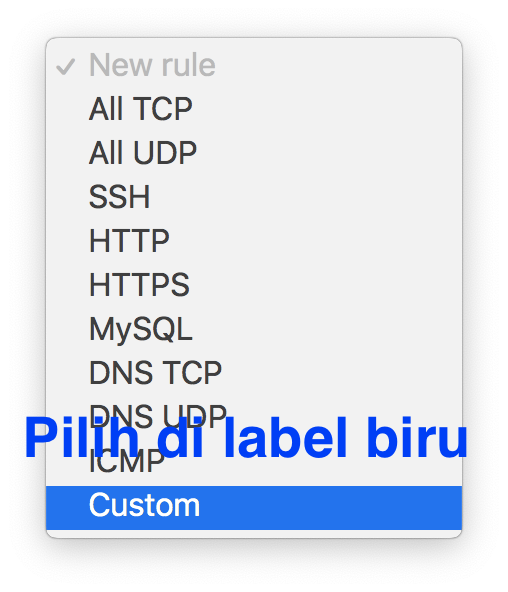

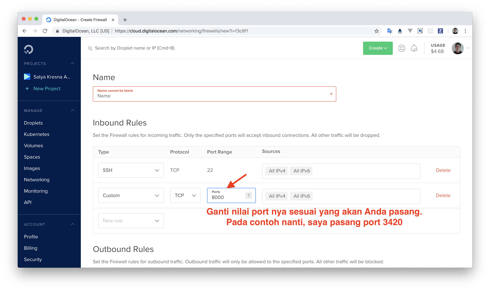

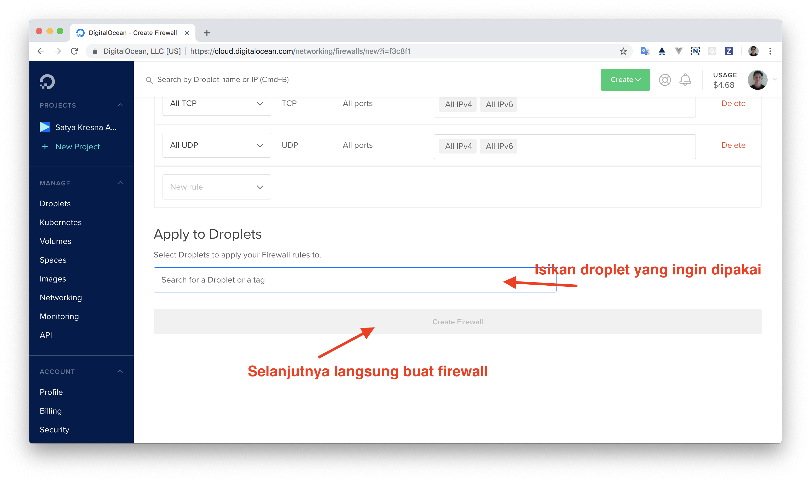

1. Di terminal VPS
```bash
# nomor 3420 hanyalah contoh, Anda bisa menggantinya sesuai kebutuhan
sudo ufw allow 3420/tcp
# Melakukan pengecekan bila port 3420 masuk dalam daftar
sudo ufw status verbose
```

Catatan: Setelah itu, silahkan logout dari server dan login ke server. Saya melihat lebih manjur memasangnya di terminal VPS,
tetapi alangkah bagusnya pasang di dua tempat.

## Mulai tahap 1
1. Membuat direktori untuk deploy hook. Saya membuat folder bernama **laravel-basic-deploy** di direktori ```/home/deployer/deploy/laravel-basic-deploy```
1. Menginstall nodejs dan npm di VPS dengan cara:
```bash
# node js
curl -sL https://deb.nodesource.com/setup | sudo bash -
sudo apt-get install -y nodejs

# npm
sudo apt-get install -y npm
```
1. Init NPM project dengan cara: ```npm init``` dan masukkan data-data yang diperlukan serta pastikan "main" diisi dengan value "index.js".
1. Download package github hook dengan perintah: ```npm install --save githubhook```
1. Membuat file index.js dan isilah script di bawah ini

```js
var execFile = require('child_process').execFile;
var githubhook = require('githubhook');
var github = githubhook({
    host: '0.0.0.0',
    port: 3420,
    path: '/gitback',
    secret: 'my-secret',
    logger: console,
});

github.listen();

// laravel-basic adalah nama repo saya.
// Anda bisa ganti dengan nama repo Anda di Github.
github.on('laravel-basic:refs/heads/master', function (data) {
    // Exec a shell script
    var execOptions = {
        maxBuffer: 1024 * 1024 // Increase max buffer to 1mb
    };

    // '/home/deployer/deploy/laravel-basic-deploy/deploy.sh' adalah direktori untuk menjalankan shell script
    // Tergantung di mana Anda mau taruh.
    execFile('/home/deployer/deploy/laravel-basic-deploy/deploy.sh', execOptions, function(error, stdout, stderr) {
        if( error )
        {
            console.log(error)
        }
    });
});
```
1. Membuat file deploy.sh dan isilah script di bawah ini

```bash
#!/usr/bin/env bash

REPO='git@github.com:satyakresna/laravel-basic.git'; #nama repo saya
RELEASE_DIR='/var/www/laravel-basic/releases'; # direktori aplikasi saya
APP_DIR='/var/www/laravel-basic/app'; # direktori aplikasi saya
RELEASE="release_`date +%Y%m%d%H%M%s`";
# tempat saya menaruh .env production file
# Jika Anda tidak ingin mengikuti cara ini pastikan Anda hapus perintah
# yang ada komentar # Copy .env file
ENV_PRODUCTION='/home/deployer/env-laravel/laravel-basic/production/.env';
ROOT_DIR='/var/www/laravel-basic';
SHARED_DIR='/var/www/laravel-basic/shared';

# Fetch Latest Code
[ -d $RELEASE_DIR ] || mkdir -p $RELEASE_DIR;
cd $RELEASE_DIR;
git clone -b master $REPO $RELEASE;

# Composer
cd $RELEASE_DIR/$RELEASE;
composer install --prefer-dist --no-scripts;
php artisan clear-compiled --env=production;
php artisan optimize --env=production;

# Update permissions
cd $RELEASE_DIR;
sudo chgrp -R www-data $RELEASE;
chmod -R ug+rwx $RELEASE;

# Check if shared directory is not exist
if [ ! -d "$SHARED_DIR" ]; then
# Create shared directory
mkdir $ROOT_DIR/shared;
cd $ROOT_DIR/shared && (mkdir -p storage storage/app storage/app/public storage/framework storage/framework/cache storage/framework/sessions storage/framework/views storage/logs);
fi

# Copy .env file
cp $ENV_PRODUCTION $ROOT_DIR/shared;

## Env File
cd $RELEASE_DIR/$RELEASE;
ln -nfs ../../shared/.env .env;
sudo chgrp -h www-data .env;

## Logs
rm -r $RELEASE_DIR/$RELEASE/storage;
cd $RELEASE_DIR/$RELEASE;
ln -nfs ../../shared/storage storage;
sudo chgrp -h www-data storage;

## Update Current Site
ln -nfs $RELEASE_DIR/$RELEASE $APP_DIR;
sudo chgrp -h www-data $APP_DIR;

## PHP
sudo service php7.2-fpm reload;

## Setup artisan key generate command
cd $APP_DIR;
php artisan key:generate

# Clear conf
php artisan config:clear
php artisan config:cache

# Run migration
php artisan migrate --force

# Symlink storage folder with public folder
php artisan storage:link
```
1. Berikan akses execute untuk deploy.sh dengan perintah:
```bash
chmod ug+x deploy.sh
```
1. Hasil akhir seperti gambar di bawah


1. Coba jalankan perintah ```bash /home/deployer/deploy/laravel-basic-deploy/deploy.sh``` dan apakah berjalan dengan lancar?
Semoga berhasil.

## Mulai tahap 2
1. Lakukan konfigurasi webhook di Github seperti gambar di bawah ini

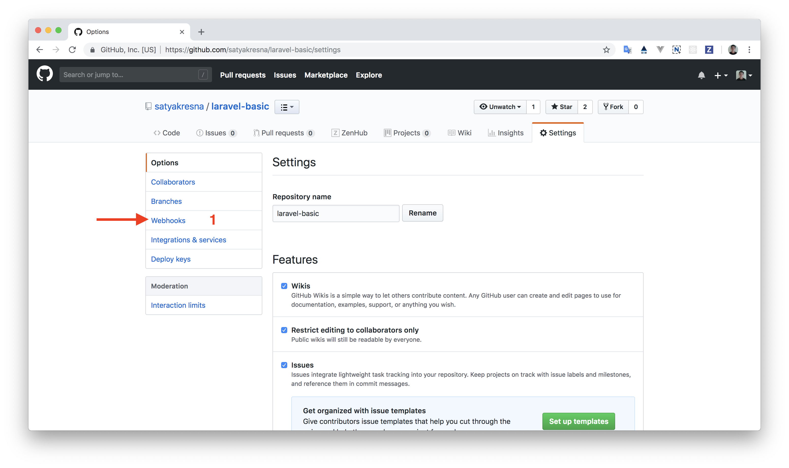

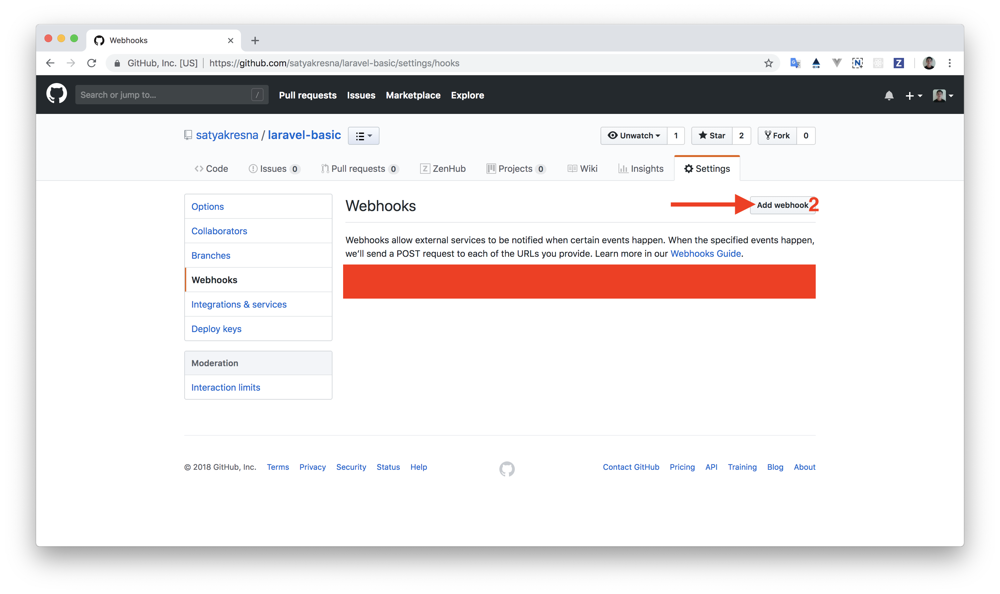

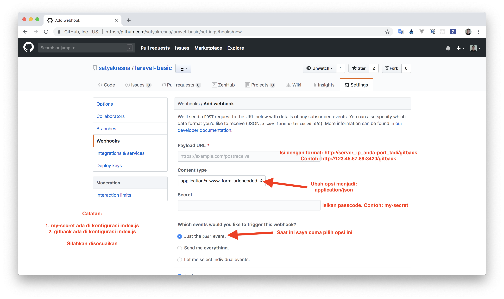

1. Jalankan perintah ```node index.js``` di dalam direktori tadi dan coba Anda perbaharui kodingan project Anda.
Misalnya membuat routing yang terhubung dengan Controller.
Kemudian lakukan git push. Hasilnya akan seperti gambar di bawah di terminal maupun di Github webhook.


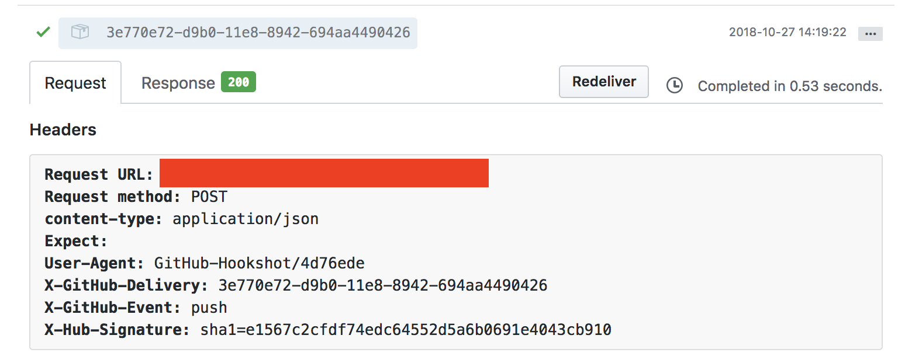

**Catatan:** *Jika Anda mengalami service time out di Github hooks, kemungkinan besar adalah Anda tidak memasang port
di VPS Anda atau port Anda pasang salah. Mohon dicek lebih teliti lagi.*

## Mulai tahap 3
Tentunya kita tidak ingin setiap kali buka terminal dan menjalankan perintah ```node index.js```.
Salah satu cara untuk menghindari ini adalah dengan membuat service yang menjalankan perintah node tadi.
Pada tutorial ini saya akan menggunakan systemd dari Ubuntu.

1. Login sebagai user yang memiliki akses sudo atau user root dan masukkan perintah di bawah ini:
```bash
# perintah ini bertujuan untuk mengarahkan Anda ke direktori system dan dari sinilah kita akan membuat service
cd /lib/systemd/system
```
1. Kemudian buat file bernama **laravel-basic-deploy.service** dan isinya seperti berikut:
```
[Unit]
Description=Laravel Basic Github Webhook

[Service]
User=deployer
Group=www-data
Restart=on-failure
ExecStart=/usr/bin/node /home/deployer/deploy/laravel-basic-deploy/index.js

[Install]
WantedBy=multi-user.target
```
1. Simpan isi file tersebut dan jalankan perintah ```sudo systemctl enable laravel-basic-deploy.service```
1. Jalankan lagi perintah ```sudo systemctl start laravel-basic-deploy.service```
1. Berikutnya kita cek apakah service yang kita buat berjalan atau tidak dengan cara ```sudo systemctl status laravel-basic-deploy.service``` dan hasilnya seperti gambar di bawah


1. Coba ubah kodingan Anda dan lakukan git push apakah hasilnya sesuai atau tidak? Jika sesuai berarti service kita berjalan dengan lancar.

## Sumber referensi
1. [Servers for hacker auto deploy with Github](https://serversforhackers.com/c/automating-deployment-from-github)
1. [Servers for hacker enhancing envoy deployment](https://serversforhackers.com/c/enhancing-envoy-deployment)

## Ucapan terima kasih
Terima kasih saya ucapkan kepada [Wayan Jimmy Gunawan](https://github.com/wayanjimmy) sudah memberikan masukan dan saran saat saya mencoba dan menyusun tutorial deployment Laravel dengan Github webhook ini. Semoga bermanfaat.
