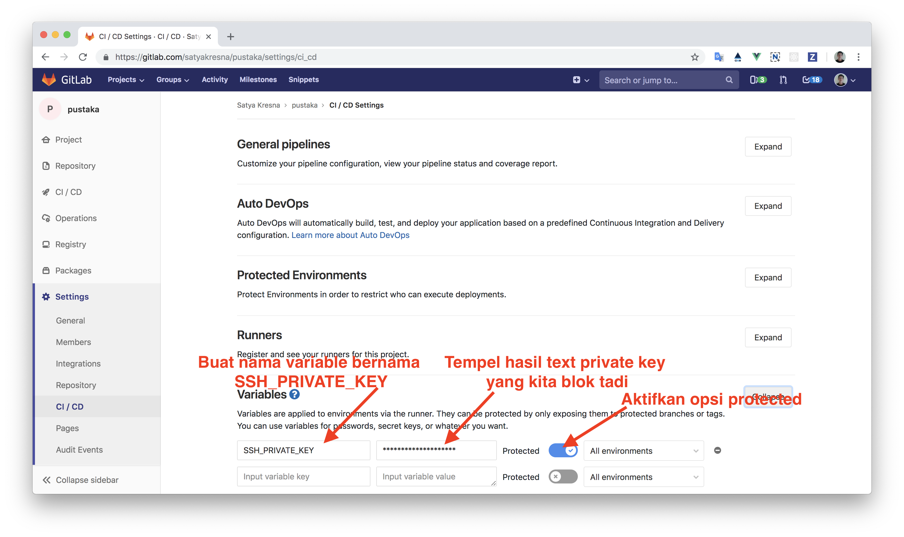
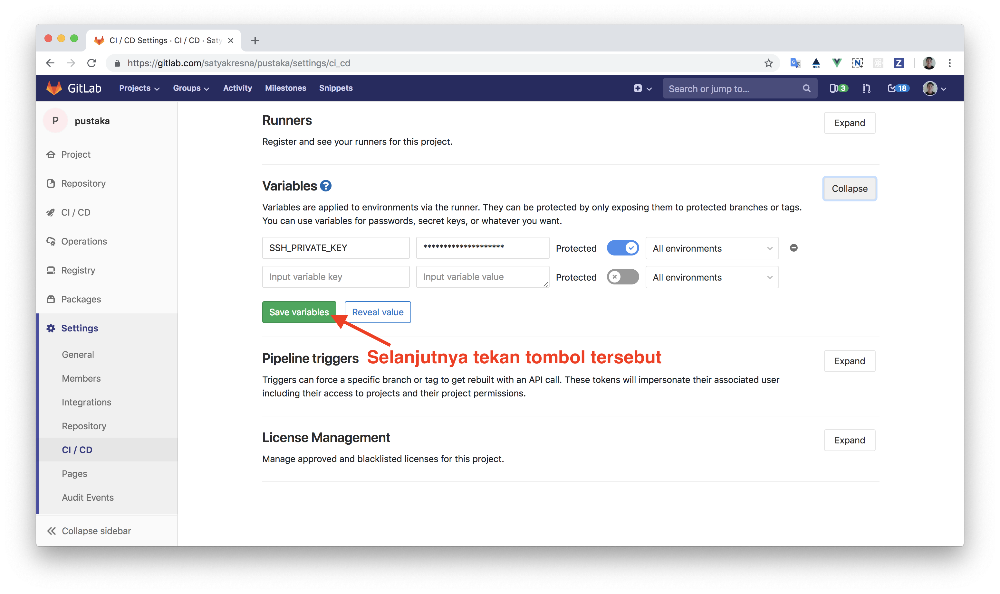

# Cara deploy web Laravel dengan Gitlab CI/CD
Bagi teman-teman yang memiliki VPS, mempunyai repository Github yang berisikan web Laravel serta kebingungan cara menyebarkan aplikasi Anda (deploy) secara terintegrasi dan otomatis maka Anda berada di tempat yang tepat. Pada bagian ini kita akan menggunakan Gitlab sebagai CI/CD deployment Laravel + Laravel Deployer.

# Catatan penting
Sebenarnya jika Anda sudah memiliki project di Gitlab maka Anda bisa langsung saja menggunakan Gitlab CI/CD nya. Namun, sebagai saya akan menggunakan Github sebagai contoh dan ada batasan yang perlu Anda ketahui. Saat ini kita bisa melakukan CI/CD via Gitlab di luar Gitlab (seperti Github atau Bitbucket) tetapi hanya berlaku sampai tanggal 22 Maret 2019. Jika lewat dari itu maka kita harus menggunakan layanan berbayar dari Gitlab.


## Mulai tahap 1
1. Koneksikan repository Github yang ingin menggunakan CI/CD Gitlab dengan login ke website Gitlab seperti gambar di bawah.


2. Membuat user bernama deployer dan memberikan akses baca tulis dan eksekusi ke user deployer. Anda bisa menggunakan user selain deployer.
```bash
# Lakukan ini di terminal VPS Anda
# Membuat user deployer
sudo adduser deployer
# Memberikan akses baca tulis dan eksekusi ke user deployer untuk directori /var/www
sudo setfacl -R -m u:deployer:rwx /var/www
```
Jika Anda tidak bisa membuat user hal ini dikarenakan Anda belum menginstall ACL, silahkan install terlebih dahulu di server Ubuntu Anda dengan perintah berikut:
```bash
sudo apt install acl
```

3. Membuat SSH key sebagai user deployer. Pastikan Anda berpindah user ke user deployer. Kemudian buatlah SSH key sesuai [artikel yang disediakan oleh Github](https://help.github.com/articles/generating-a-new-ssh-key-and-adding-it-to-the-ssh-agent/).

4. Setelah berhasil membuat SSH key, selanjutnya lakukan duplikat konten public key SSH ke authorized keys.
```bash
# As the deployer user on server
#
# Copy the content of public key to authorized_keys
cat ~/.ssh/id_rsa.pub >> ~/.ssh/authorized_keys
```

5. Berikutnya duplikat isi private key dan kita akan taruh di project Gitlab kita.
```bash
# Copy the private key text block
cat ~/.ssh/id_rsa
# Blok isi dari private key tadi, copy dan tempel di Gitlab project kita seperti gambar di bawah.
```




6. Melakukan duplikat isi public key dan kita taruh di project Gitlab kita.
```bash
# As the deployer user on the server
#
# Copy the public key
cat ~/.ssh/id_rsa.pub
# Blok isi dari public key tadi, copy dan tempel di Gitlab project kita seperti gambar di bawah.
```


## Mulai tahap 2
1. Langkah berikutnya memasang pustaka Laravel Deployer di project Laravel dengan perintah berikut.

```bash
composer require lorisleiva/laravel-deployer
```

2. Menjalankan perintah ```php artisan deploy:init``` dan Anda akan dihadapkan dengan beberapa pertanyaan serta setelah itu hasil pertanyaan tersebut akan di simpan dalam file ```config/deploy.php```.

3. Di dalam file deploy.php, kita buat konfigurasi seperti gist di bawah.

<script src="https://gist.github.com/satyakresna/1acf9a1838b01c5f529c3b8ad1a24488.js"></script>

4. Di dalam file `deploy.php` tadi, kita memasukkan resep bernama `deploy_secrets.php`. Berikut konfigurasi gist nya.

<script src="https://gist.github.com/satyakresna/1acf9a1838b01c5f529c3b8ad1a24488.js"></script>

## Mulai tahap 3
1. Membuat file ```.gitlab-ci.yml``` dan isinya Anda bisa lihat di [gist Github milik saya](https://gist.github.com/satyakresna/2091cc46a6dcef094d3f9ace4ae75d45).

2. Selanjutnya commit file ```.gitlab-ci.yml``` dan lakukan Git push dan hasilnya akan muncul **pipelines** seperti gambar di bawah.


Catatan:
1. "$SSH_PRIVATE_KEY" diambil dari private key di CI/CD Gitlab kita tadi.
2. Perhatikan script bagian terakhir pada file ```.gitlab-ci.yml```.
```yml
production:
    stage: deploy
    script:
        - *init_ssh
        - *change_file_permissions
        - php artisan deploy yourdomain.com -s production -vvv
    environment:
        name: production
        url: http://yourstagingdomain.com
    when: manual # Perhatikan
    only:
        - master
```
Di sana fungsi manual adalah menyediakan fasilitas trigger manual untuk deployment, jika Anda menghilangkannya maka akan otomatis deploy. Untuk fasilitas trigger manual, Gitlab menyediakan tombol "play" pada gambar nomor 10. Jika Anda yakin dengan commit Anda buat dan lolos tes maka silahkan tekan tombol tersebut.

## Sumber referensi
1. [Test and deploy Laravel applications with GitLab CI/CD and Envoy](https://docs.gitlab.com/ee/ci/examples/laravel_with_gitlab_and_envoy/#configure-the-production-server)
1. [Using GitLab's pipeline with Laravel](http://lorisleiva.com/using-gitlabs-pipeline-with-laravel/)

## Ucapan terima kasih dan mohon maaf
Terima kasih bagi Anda yang telah membaca tutorial ini dan jika berhasil mencobanya selamat! Mohon maaf bila tutorial ini saya buat buru-buru. Intinya saya membuat catatan kecil untuk diri saya jika saya lupa.
